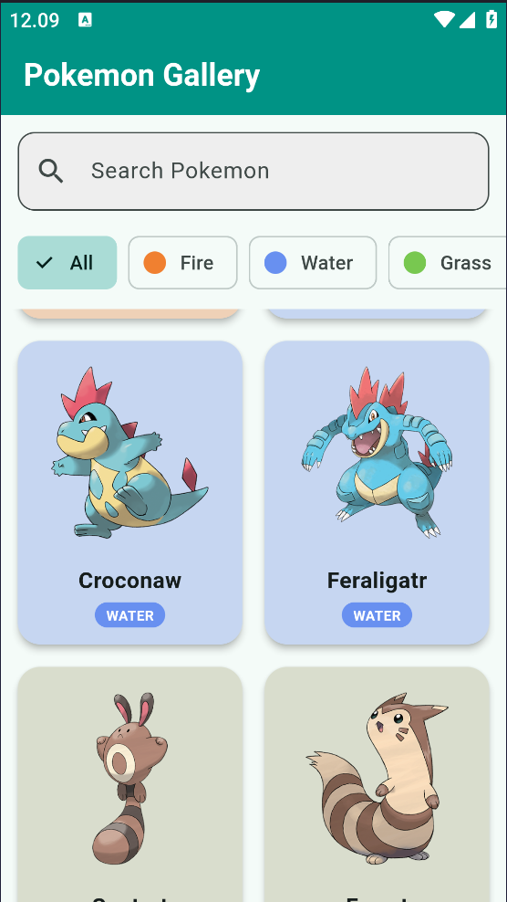
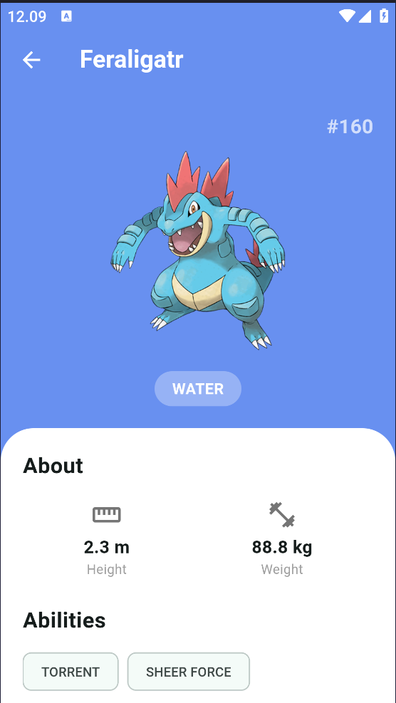

# 🎮 PokeGallery

A beautiful Pokedex app built with Flutter using Clean Architecture.


## Features

- Browse 1000+ Pokemon with infinite scroll
- Search Pokemon by name
- Filter by type (Fire, Water, Grass, etc.)
- Type-based color themes
- Detailed stats with progress bars
- Splash screen with loading progress
- Optimized batch loading

## Screenshots

| Home                           | Detail               |
| ------------------------------ | -------------------- |
|  |  |

## Architecture

```
lib/
├── main.dart              # Entry point
├── models/                # Data models
│   └── pokemon.dart
├── services/              # API services
│   └── pokemon_service.dart
├── pages/                 # Screens
│   ├── home_page.dart
│   ├── detail_page.dart
│   └── splash_screen.dart
├── widgets/               # Reusable components
│   └── pokemon_card.dart
└── utils/                 # Utilities
    └── type_colors.dart
```

## Getting Started

### Prerequisites

- Flutter SDK ^3.10.4
- Dart SDK ^3.10.4

### Installation

```bash
# Clone the repository
git clone https://github.com/farizziezhi/pokegallery.git

# Navigate to project
cd pokegallery

# Get dependencies
flutter pub get

# Run the app
flutter run
```

## Dependencies

- `http` - HTTP requests
- `flutter` - UI framework

## API

This app uses [PokeAPI](https://pokeapi.co/) to fetch Pokemon data.

## License

This project is open source and available under the MIT License.

## Acknowledgments

- [PokeAPI](https://pokeapi.co/) for the Pokemon data
- Pokemon images from [PokeAPI Sprites](https://github.com/PokeAPI/sprites)
